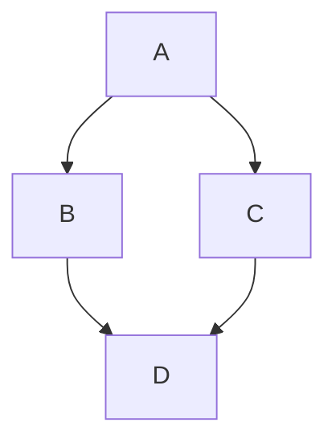

## Graph syntax:  
https://mermaid.js.org/intro/

````marcdown

```mermaid
flowchart TD
    A-->B;
    A-->C;
    B-->D;
    C-->D;
```
````

will give you


```mermaid
flowchart TD
    A-->B;
    A-->C;
    B-->D;
    C-->D;
```
