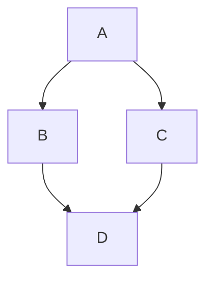
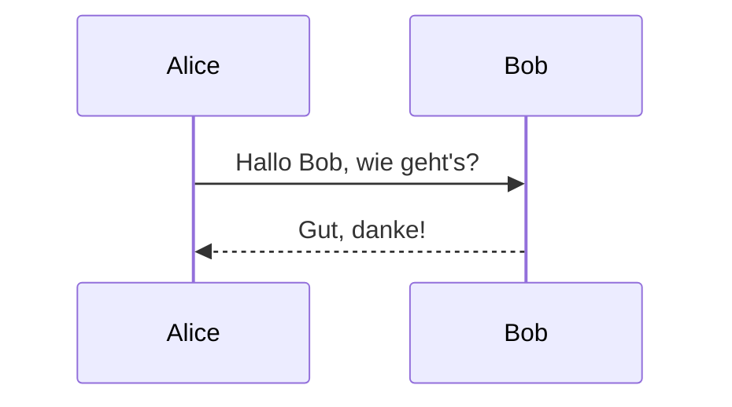
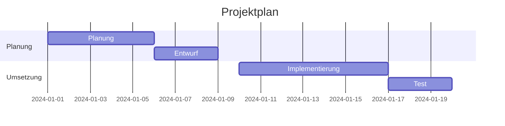
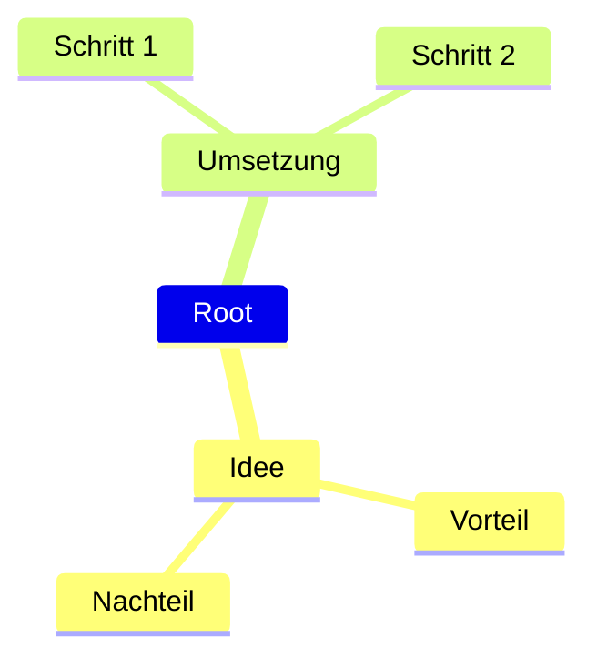

## Flow Chart

````marcdown

````

will give you


## Sequenzdiagramm 



## Gantt-Diagramm 



## Mindmap 



## Notes

There are more examples at: https://mermaid.js.org/intro/.

Basically the diagram js libraries are loaded from cdn.jsdelivr.net.
So you have to be online to see the diagrams.

