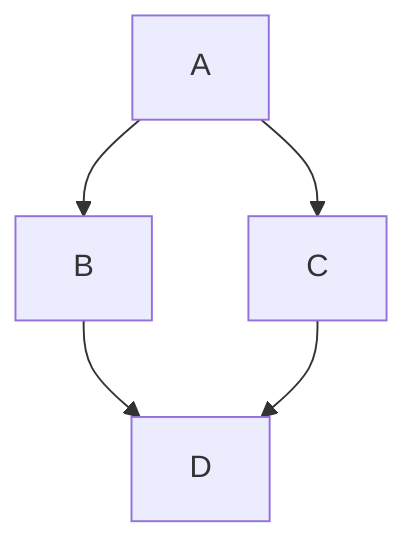

# Textfeatures

## Basic MarcDown syntax:  
https://www.markdownguide.org/basic-syntax/

## Graph syntax:  
https://mermaid.js.org/intro/

````marcdown

````

will give you


## Code:

````marcdown
```php
phpinfo();
```
````
will give you

```php
phpinfo();
```


## Tables:

Use pure html and css.

```html
<table id="table-1">
<tr><td id="table-1_1_1">1x1</td><td>2x1</td></tr>
<tr><td>1x2</td><td>2x2</td></tr>
</table>
<style>
#table-1{background:lime;}
#table-1 td{padding:10px;}
#table-1_1_1{background:yellow;}
</style>
```

will turn to

<table id="table-1">
<tr><td id="table-1_1_1">1x1</td><td>2x1</td></tr>
<tr><td>1x2</td><td>2x2</td></tr>
</table>
<style>
#table-1{background:lime;}
#table-1 td{padding:10px;}
#table-1_1_1{background:yellow;}
</style>

